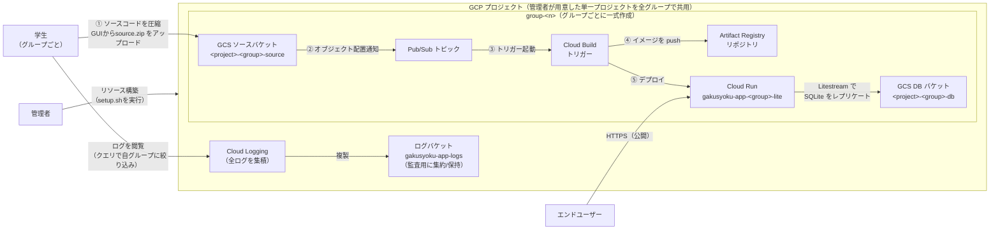

# 賢い子へ
数日でいきなり作ったからほぼAI駆動なんだわ！コード汚くてごめんな！

# 設計書

ソースコードレポジトリ:[`gakusyoku_app`](https://github.com/cit-nomoto/gakusyoku_app)

本レポジトリにおけるインフラリソースの設計を記す。

## 目次

1. [背景と目的](#1-背景と目的)
2. [全体構成](#2-全体構成)
3. [開発アーキテクチャ（方式設計）](#3-開発アーキテクチャ方式設計)
   - [インフラ構成](#31-インフラ構成) / [ソリューション](#32-ソリューション) / [開発言語・技術スタック](#33-開発言語技術スタック)
4. [実行アーキテクチャ（非機能設計）](#4-実行アーキテクチャ非機能設計)
   - [セキュリティ設計](#41-セキュリティ設計) / [可用性・データ保全](#42-可用性データ保全) / [ログ設計](#43-ログ設計) / [運用設計](#44-運用設計)
5. [トラブルシューティング](#5-トラブルシューティング)

---

## 1. 背景と目的

### 1.1 背景

学食メニュー満足度アプリは、Web アプリ開発を学ぶ講義の題材である。学生はグループ単位でこのアプリを開発・改修し、成果物を実際にクラウド上で動かして確認する。

このとき「グループごとの実行環境をどう用意するか」が課題になる。

- 学生に GCP プロジェクトを個別に作成・契約させると、課金やアカウント管理の負担が大きく、講義の本題（アプリ開発）から外れる
- かといって全グループが 1 つの環境を無秩序に共有すると、あるグループの操作が他グループの成果物を壊しうる
- デプロイのたびに複雑なインフラ操作を学生に求めると、講義時間がインフラのトラブル対応に費やされてしまう

### 1.2 目的

上記の背景から、本設計は次の 4 点を目的とする。

1. **単一プロジェクトでの多グループ運用**: 管理者が用意した 1 つの GCP プロジェクト内に、グループの数だけ独立したアプリ実行環境（Cloud Run・GCS・Cloud Build 等の一式）を作成する。学生が自分でプロジェクトを契約する必要はない
2. **グループ間の隔離**: 各学生は IAM により **自分のグループの資源にのみ** アクセスできる。アップロードしたコードに問題があっても、影響は自グループに閉じる
3. **学生の作業の最小化**: 学生の操作は「ソース zip を GCS にアップロードする」だけ。ビルドからデプロイまでは自動で実行される
4. **管理者の運用の省力化**: 全資源を Terraform でコード管理し、グループの追加・削除は `terraform.tfvars` の編集と apply だけで完結する

### 1.3 設計方針

| 方針 | 実現方法 |
|---|---|
| 低コスト | FaaSを利用しWebアプリのホストに掛かるコストを低減する。 |
| グループ間の隔離 | バケット・リポジトリ・サービスアカウントをグループごとに分割し、IAM はプロジェクトレベルではなく資源単位で付与 |
| 学生の作業を最小化 | GCS へのソース zip アップロードだけでビルド〜デプロイが自動実行される |
| インフラ資源のコード化 | すべての資源を Terraform で管理。グループは `terraform.tfvars` の `groups` 変数で宣言的に定義 |

### 1.4 グループの定義

グループは `terraform/terraform.tfvars` で定義する。エントリを追加して `terraform apply` するだけで、そのグループ用の資源一式が作成される。

```hcl
groups = {
  team-a = ["student1@example.com"]
  team-b = ["student2@example.com", "student3@example.com"]
}
```

Terraform 上は [`terraform/modules/group/`](../terraform/modules/group/) が「グループ 1 つ分の資源一式」を定義しており、[`terraform/groups.tf`](../terraform/groups.tf) が `for_each = var.groups` で展開する。

---

## 2. 全体構成

### 2.1 構成図



---

## 3. 開発アーキテクチャ（方式設計）

本システムを「何を使って・どういう仕組みで」実現するかを定める。

### 3.1 インフラ構成

#### 3.1.1 プロジェクト共有リソース

グループによらずプロジェクトに 1 つだけ存在するリソース。

| リソース | 用途 | 定義ファイル |
|---|---|---|
| API の有効化（Artifact Registry / Cloud Run / Cloud Build / Pub/Sub） | 各サービスの利用に必要 | [apis.tf](../terraform/apis.tf) |
| ログバケット + シンク（`<app>-logs`） | 全グループの Cloud Run ログの集約（監査・保全用）。アクセス制御用ではない | [logging.tf](../terraform/logging.tf) |

#### 3.1.2 グループ単位リソース

以下は **グループごとに 1 セット** 作成される（`<project>` はプロジェクト ID、`<group>` はグループ名、`<app>` は `app_name`＝既定 `gakusyoku-app`）。

| リソース | 名前 | 用途 | 定義ファイル |
|---|---|---|---|
| GCS バケット | `<project>-<group>-source` | ソース zip・ビルド設定の置き場 | [storage.tf](../terraform/modules/group/storage.tf) |
| GCS バケット | `<project>-<group>-db` | Litestream の SQLite レプリカ先 | [storage.tf](../terraform/modules/group/storage.tf) |
| Pub/Sub トピック | `<app>-<group>-source-upload` | アップロード通知 | [storage.tf](../terraform/modules/group/storage.tf) |
| Artifact Registry | `<app>-<group>` | アプリイメージの保管。タグ無しの古いイメージは 1 日後に自動削除（ストレージ課金対策） | [artifact_registry.tf](../terraform/modules/group/artifact_registry.tf) |
| Cloud Build トリガー | `<app>-<group>-deploy` | ビルド〜デプロイの自動実行 | [cloudbuild.tf](../terraform/modules/group/cloudbuild.tf) |
| Cloud Run サービス | `<app>-<group>-lite` | アプリ本体（公開 URL） | [cloud_run.tf](../terraform/modules/group/cloud_run.tf) |
| サービスアカウント | `<app>-<group>` | Cloud Run 実行用（ランタイム SA） | [cloud_run.tf](../terraform/modules/group/cloud_run.tf) |
| サービスアカウント | `<app>-<group>-bt` | Cloud Build トリガー実行用（ビルド SA） | [cloudbuild.tf](../terraform/modules/group/cloudbuild.tf) |

#### 3.1.3 ソースバケットの内部構成

| パス | 内容 | 管理者 |
|---|---|---|
| `config/Dockerfile` ほか | ビルド設定（`docker/` 配下と同期） | Terraform が管理。学生は読み取りのみ |
| `gakusyoku-app/source.zip` | アプリのソース zip | 学生がアップロード（自動デプロイの起点） |

#### 3.1.4 命名規則と制約

- グループ名は **小文字英字始まり・小文字英数字とハイフンのみ・12 文字以内**。
  サービスアカウント ID の上限（30 文字）に `<app>-<group>-bt` を収めるための制約で、[`variables.tf`](../terraform/variables.tf) の validation で強制している。
- GCS バケット名はグローバルに一意である必要があるため、プロジェクト ID をプレフィックスに含めている。

### 3.2 ソリューション

採用したサービス・OSS と選定理由は以下のとおり。

| 領域 | 採用ソリューション | 選定理由 |
|---|---|---|
| アプリ実行基盤 | Cloud Run | FaaS・従量課金でホストコストを最小化（→ [1.3](#13-設計方針)）。OS 管理が不要（→ [4.1.5](#415-実行環境の堅牢性cloud-run)） |
| ビルド・デプロイ | GCS + Pub/Sub + Cloud Build | zip のアップロードだけでビルド〜デプロイが走る。学生に CI/CD の設定・操作を求めない |
| イメージ保管 | Artifact Registry | グループ単位にリポジトリを分割でき、IAM による隔離単位になる |
| データ永続化 | SQLite + Litestream + GCS | DB サーバ（Cloud SQL 等）の常時稼働コストを避けつつ、コンテナ再起動を跨いでデータを保持する |
| インフラ管理 | Terraform | 全資源をコード化し、`groups` 変数によるグループの宣言的管理を実現する |

主要な方式の詳細を以下に示す。

#### 3.2.1 自動デプロイ方式

学生が `gs://<project>-<group>-source/gakusyoku-app/source.zip` をアップロードすると、以下が自動実行される。

1. GCS のオブジェクト配置通知（`OBJECT_FINALIZE`）が Pub/Sub トピックに発行される
2. Cloud Build トリガーが起動し、ビルド SA で以下のステップを実行する
   1. ソースバケットから `config/`（Dockerfile・litestream.yml・run.sh）をダウンロード
   2. `gakusyoku-app/source.zip` をダウンロードして展開
   3. Docker イメージをビルド
   4. Artifact Registry に push（タグ: `app:latest`）
   5. DB バケットのレプリカを削除（DB を zip 同梱のシードデータにリセット → [3.2.3](#323-データ永続化方式litestream)）
   6. `gcloud run deploy` で Cloud Run に反映

所要時間は数分程度。進捗は Console の Cloud Build ビルド履歴で確認できる（学生は `roles/cloudbuild.builds.viewer` により閲覧のみ可能）。ビルドログはログ エクスプローラでも閲覧できる（→ [4.4.3](#443-ログの閲覧学生)）。

#### 3.2.2 初回構築時のブートストラップ

Cloud Run は作成時にイメージが必要だが、初回 apply 時点ではアプリイメージが存在しない。そのため:

1. Cloud Run はプレースホルダイメージ（`us-docker.pkg.dev/cloudrun/container/hello`）で作成される
2. Terraform がリポジトリ直下の `source.zip`（アプリの初期ソース）を、トリガー・通知の作成後に各グループのソースバケットへアップロードする
3. これが [3.2.1](#321-自動デプロイ方式) の自動デプロイを起動し、実アプリに置き換わる

以降のイメージ更新は Cloud Build 側で行われ、Terraform はイメージの差分を無視する（`ignore_changes`）。

#### 3.2.3 データ永続化方式（Litestream）

DB は SQLite ファイル（`/app/instance/app.db`）で、[Litestream](https://litestream.io/) が GCS へ継続的にレプリケートする。

- **起動時**（[`docker/run.sh`](../docker/run.sh)）: DB バケットにレプリカがあれば `litestream restore` で復元してからアプリを起動する。レプリカが無い場合は source.zip 同梱の `instance/app.db` をシードデータとしてそのまま使う（同梱 DB も無ければアプリが新規 DB を作成する）
- **デプロイ時**: Cloud Build がデプロイ直前に DB バケットのレプリカを削除する（→ [3.2.1](#321-自動デプロイ方式) Step 5）。**source.zip をアップロードするたびに DB は zip 同梱の内容にリセットされる**（zip の DB がマスター）。デプロイとデプロイの間の再起動ではレプリカから復元され、データは保持される
- **注意**: GCS 上のレプリカ（`app.db/` 配下）は Litestream 独自形式（スナップショット + WAL）であり、SQLite ファイルそのものではない。素の `.db` ファイルを直接バケットに置いても復元されない。初期データを変えたい場合は source.zip 内の `instance/app.db` を差し替える
- **稼働中**: `litestream replicate` が変更を DB バケットへ送り続ける
- レプリカ先バケット名は Cloud Run の環境変数 `REPLICA_BUCKET` で渡され、[`docker/litestream.yml`](../docker/litestream.yml) が参照する

この方式に伴う可用性上の制約は [4.2](#42-可用性データ保全) を参照。

### 3.3 開発言語・技術スタック

| 区分 | 技術 | 備考 |
|---|---|---|
| Web アプリ | Python 3.12 / Flask（Flask-SQLAlchemy・Jinja2） | ソースは [`gakusyoku_app/`](../gakusyoku_app/)。依存は [`requirements.txt`](../gakusyoku_app/requirements.txt) で管理 |
| WSGI サーバ | gunicorn | ワーカー数 1（SQLite の単一ライター制約に合わせる → [4.2](#42-可用性データ保全)） |
| データベース | SQLite | Litestream で GCS へレプリケート（→ [3.2.3](#323-データ永続化方式litestream)） |
| データ分析 | pandas / scikit-learn / matplotlib | 満足度の集計・可視化に使用 |
| コンテナ | Docker（`python:3.12-slim`、マルチステージビルド） | [`docker/Dockerfile`](../docker/Dockerfile)。Litestream バイナリをビルドステージで取得 |
| インフラ定義 | Terraform（HCL） | [`terraform/`](../terraform/) 配下 |
| 運用スクリプト | Bash / PowerShell | [`scripts/`](../scripts/) 配下。macOS・Linux と Windows の両対応 |

---

## 4. 実行アーキテクチャ（非機能設計）

本システムを「安全に・データを失わず・少ない手間で」稼働させ続けるための設計を定める。

### 4.1 セキュリティ設計

#### 4.1.1 基本方針: グループ間の隔離

**プロジェクトレベルのロール付与を原則使わず、資源単位で付与する。** これがグループ間隔離の根拠になる（他グループの資源にはバインディング自体が存在しない）。ポイントは 2 つ。

- 学生本人の権限を資源単位で付与し、他グループの資源にはバインディング自体を作らない
- 学生は source.zip を通じて Cloud Build 上で任意のコードを実行できるため、**ビルド SA・ランタイム SA の権限も自グループの資源に限定**している。アップロードしたコードが悪意を持っていても、影響は自グループの資源に閉じる

#### 4.1.2 学生の権限

| ロール | 付与先 | できること |
|---|---|---|
| `roles/storage.objectUser`（条件付き） | 自グループのソースバケット | `gakusyoku-app/` 配下へのアップロード・上書き。`config/` 配下（Dockerfile 等）は書き換え不可 |
| `roles/storage.legacyBucketReader` | 自グループのソースバケット | バケット内オブジェクトの一覧・閲覧 |
| `roles/storage.objectUser` | 自グループの DB バケット | DB レプリカの閲覧・削除（データリセット用 → [4.4.6](#446-db-のバックアップ復元管理者)） |
| `roles/storage.legacyBucketReader` | 自グループの DB バケット | バケット内オブジェクトの一覧・閲覧 |
| `consoleLister`（カスタムロール） | プロジェクト | バケット・Cloud Run サービス一覧の閲覧（`storage.buckets.list`・`run.services.list`・`run.locations.list` のみ）。Console の一覧ページから自グループの資源にたどり着くために付与 |
| `roles/run.viewer` | 自グループの Cloud Run サービス | サービス状態・リビジョンの閲覧 |
| `roles/cloudbuild.builds.viewer` | プロジェクト | ビルド履歴・ステータスの閲覧（デプロイの進捗・失敗確認用） |
| `roles/logging.viewer` | プロジェクト | ログの閲覧。自グループのログはクエリで絞り込む（→ [4.4.3](#443-ログの閲覧学生)） |

#### 4.1.3 ビルド SA の権限

学生は source.zip の内容を通じて Cloud Build 上で任意のコードを実行できるため、**ビルド SA の権限がそのまま学生の実効権限になる**。よって自グループの資源に限定する。

| ロール | 付与先 |
|---|---|
| `roles/storage.objectViewer` | 自グループのソースバケット |
| `roles/storage.objectAdmin` | 自グループの DB バケット（デプロイ時のレプリカ削除用） |
| `roles/artifactregistry.writer` | 自グループのリポジトリ |
| `roles/run.developer` | 自グループの Cloud Run サービス |
| `roles/iam.serviceAccountUser` | 自グループのランタイム SA |
| `roles/logging.logWriter` | プロジェクト（ログ書き込みのみ。閲覧は不可） |

#### 4.1.4 ランタイム SA の権限

| ロール | 付与先 |
|---|---|
| `roles/storage.objectAdmin` | 自グループの DB バケットのみ |

#### 4.1.5 実行環境の堅牢性（Cloud Run）

Cloud Run はフルマネージドなサーバレス実行環境であり、VM（Compute Engine 等）で運用する場合に必要な OS 管理が存在しない。

- SSH などの管理用ポートを持たず、OS レイヤへの不正侵入の攻撃面がそもそもない
- OS・ホスト側のセキュリティパッチ適用は GCP 側で行われ、管理者による定期メンテナンス作業が不要
- コンテナはデプロイ単位（リビジョン）で不変であり、仮に侵害されても再デプロイで元の状態に戻る

#### 4.1.6 既知のリスクと許容事項

| 項目 | 内容 | 判断 |
|---|---|---|
| ログの相互閲覧 | GCP にはサービス単位のログ閲覧権限がないため `logging.viewer` はプロジェクトレベルで付与しており、学生は他グループのログも読み取りできる（書き込み・削除は不可） | 講義用途では許容 |
| 資源名の相互閲覧 | `storage.buckets.list`・`run.services.list` はプロジェクト単位の権限のため、学生は Console の一覧で他グループのバケット名・サービス名等のメタデータも見える（中身の閲覧・変更・削除は不可） | 講義用途では許容 |
| ビルド履歴の相互閲覧 | Cloud Build のビルドには資源単位の IAM が無いため `cloudbuild.builds.viewer` はプロジェクトレベルで付与しており、学生は他グループのビルド履歴・ログも閲覧できる（実行・キャンセルは不可） | 講義用途では許容 |
| アプリの公開 | Cloud Run の URL は `allUsers` に公開されている | アプリ内のログイン機能で認証。機微データは扱わない前提 |
| Terraform 実行ユーザー | 各ソースバケットの `roles/storage.admin` を保持する（config ファイルの管理用） | 管理者のみが実行する前提 |

### 4.2 可用性・データ保全

- **単一インスタンス制約**: SQLite は単一ライターのため、Cloud Run の最大インスタンス数は 1 に固定している（gunicorn のワーカー数も 1）。インスタンス障害時は Cloud Run が自動で再起動し、起動時に Litestream がレプリカから DB を復元する（→ [3.2.3](#323-データ永続化方式litestream)）。スケールアウトが必要になった場合は Cloud SQL 等への移行が必要
- **データ保全**: 稼働中は Litestream が変更を継続的に DB バケットへレプリケートするため、コンテナの再起動・再デプロイを跨いでデータが保持される
- **データ消失リスク**: 全バケットは `force_destroy = true` であり、`terraform destroy` やグループ削除で **DB レプリカを含む全データが確認なしに消える**。必要なデータは事前に退避する（→ [4.4.6](#446-db-のバックアップ復元管理者)）

### 4.3 ログ設計

- アプリ・ビルドのログはすべて Cloud Logging に集積される
- プロジェクト共有のログバケット + シンク（`<app>-logs`、→ [3.1.1](#311-プロジェクト共有リソース)）が全グループの Cloud Run ログを監査・保全用に複製する。ログバケットはアクセス制御用ではない
- 学生には `logging.viewer` をプロジェクトレベルで付与し、閲覧時にクエリで自グループに絞り込む運用とする（権限上の制約は [4.1.6](#416-既知のリスクと許容事項) を参照）

### 4.4 運用設計

登場する操作主体は管理者と学生の 2 者。管理者は環境のライフサイクル（構築・変更・破棄）を、学生はアプリのデプロイとログ確認のみを担う。

#### 4.4.1 初期構築（管理者）

前提: `terraform` / `gcloud` がインストール済みで、`gcloud auth login` と `gcloud auth application-default login` が完了していること。

```bash
cp terraform/terraform.tfvars.example terraform/terraform.tfvars
# project_id と groups を編集する

./scripts/setup.sh
```

Windows（PowerShell）の場合:

```powershell
Copy-Item terraform/terraform.tfvars.example terraform/terraform.tfvars
# project_id と groups を編集する

.\scripts\setup.ps1
```

完了時にグループごとのサービス URL とアップロード先バケットが表示される。初回デプロイは Cloud Build が非同期で行うため、URL に実アプリが出るまで数分かかる（→ [3.2.2](#322-初回構築時のブートストラップ)）。

#### 4.4.2 アプリのデプロイ（学生）

1. `gakusyoku_app/` 配下のファイルが **zip のルート直下に来るように** zip を作成する

   ```bash
   cd gakusyoku_app
   zip -r ../source.zip .
   ```

   ルート直下に `main.py`・`models.py`・`requirements.txt`・`routes/`・`static/`・`templates/` が並ぶ構成が正。`gakusyoku_app/` というフォルダごと zip に入れると失敗する。

2. 自グループのバケットへアップロードする（オブジェクト名は `gakusyoku-app/source.zip` 固定）

   ```bash
   gsutil cp source.zip gs://<project>-<group>-source/gakusyoku-app/source.zip
   ```

   GCP Console からアップロードする場合は、バケット内の `gakusyoku-app/` フォルダに `source.zip` という名前で配置する。

3. 数分待って、サービス URL で反映を確認する

#### 4.4.3 ログの閲覧（学生）

もっとも簡単なのは Cloud Run コンソールから見る方法。

1. GCP Console → **Cloud Run** → 自グループのサービス（`gakusyoku-app-<group>-lite`）を開く
2. **ログ** タブを開く（自サービスのログに絞り込まれた状態で表示される）

ログ エクスプローラで検索する場合は、クエリで自グループのサービスに絞り込む。

```
resource.type="cloud_run_revision"
resource.labels.service_name="gakusyoku-app-<group>-lite"
```

> 権限上は他グループのログも閲覧できる（→ [4.1.6](#416-既知のリスクと許容事項)）が、運用としては自グループのログのみを対象とすること。

#### 4.4.4 グループの追加・削除（管理者）

`terraform/terraform.tfvars` の `groups` を編集して apply する。

```bash
terraform -chdir=terraform apply
```

- **追加**: エントリを足すと資源一式が作成され、初回デプロイまで自動で走る
- **削除**: エントリを消すとそのグループの資源が **すべて破棄される**。バケットは `force_destroy = true` のため **DB レプリカを含む全データが消える**。必要なら事前に退避する（→ [4.4.6](#446-db-のバックアップ復元管理者)）

#### 4.4.5 学生の追加・削除（管理者）

`groups` 内の該当グループのメールアドレスリストを編集して apply する。IAM バインディングのみが変更され、資源には影響しない。

#### 4.4.6 DB のバックアップ・復元（管理者）

```bash
# バックアップ（レプリカ一式を退避）
gsutil -m cp -r gs://<project>-<group>-db/* gs://<退避先>/

# ローカルで内容を確認したい場合（litestream CLI が必要）
litestream restore -o ./app.db gcs://<project>-<group>-db/app.db
```

DB をシードデータに戻す最も簡単な方法は **source.zip を再アップロード（デプロイ）すること**。デプロイのたびにレプリカが削除され、zip 同梱の `instance/app.db` で立ち上がり直す（→ [3.2.3](#323-データ永続化方式litestream)）。デプロイせずに戻したい場合は、DB バケット内の `app.db/` 配下を削除してインスタンスの入れ替わりを待ってもよい（学生も自グループの DB バケットへの削除権限を持つ）。

#### 4.4.7 手動デプロイ（管理者）

自動デプロイを経由せず、リポジトリのソースから直接ビルド・デプロイする場合:

```bash
./scripts/deploy.sh <group>       # 例: ./scripts/deploy.sh team-a
```

Windows（PowerShell）の場合:

```powershell
.\scripts\deploy.ps1 <group>      # 例: .\scripts\deploy.ps1 team-a
```

`gcloud builds submit` を使うため、実行者にはプロジェクトレベルの Cloud Build / Artifact Registry / Cloud Run 権限が必要（学生の権限では実行できない）。

#### 4.4.8 環境の破棄（管理者）

```bash
terraform -chdir=terraform destroy
```

全バケットが `force_destroy = true` のため、確認なしに全データが削除される点に注意。

> **ログバケットの削除保留（7 日間）に注意**
>
> Cloud Logging のログバケット（`<app>-logs`）は、削除しても即座には消えず **7 日間 `DELETE_REQUESTED`（削除保留）状態** で残る。これは誤削除・証拠隠滅からログを守るための GCP 側の仕様で、短縮や即時削除はできない。
>
> この期間中はバケットの変更・同名での再作成が一切できないため、**destroy 直後に再度 apply すると次のエラーで失敗する**。
>
> ```
> Error 400: Buckets must be in an ACTIVE state to be modified
> ```
>
> 環境を作り直したい場合は、削除保留中のバケットを復活させて再利用する。
>
> ```bash
> # バケットを ACTIVE に戻す
> gcloud logging buckets undelete gakusyoku-app-logs --location=global --project=<project>
>
> # apply 失敗で taint されている場合は解除する（taint のままだと削除→再作成が走り、同じエラーになる）
> terraform -chdir=terraform untaint google_logging_project_bucket_config.app
> ```

---

## 5. トラブルシューティング

| 症状 | 確認ポイント |
|---|---|
| zip をアップロードしてもデプロイされない | オブジェクト名が `gakusyoku-app/source.zip` になっているか。Cloud Build のビルド履歴にビルドが起動しているか。Pub/Sub トピックへの通知設定が生きているか |
| ビルドは走るが失敗する | zip の内部構成（ルート直下に `main.py` 等があるか）、`requirements.txt` の不備。ビルドログはすべて Cloud Logging に出力される |
| サービス URL がプレースホルダ（hello）のまま | 初回の自動デプロイが未完了か失敗している。Cloud Build のビルド履歴を確認する |
| アプリ起動直後にデータが消えている | Litestream の復元失敗。Cloud Run のログで `litestream restore` のエラーを確認。ランタイム SA に DB バケットへの権限があるか確認する |
| 学生がログを見られない | terraform.tfvars の `groups` に学生のメールアドレスが登録され apply 済みか。GCP Console に該当アカウントでログインしているか |
| apply が `Error 400: Buckets must be in an ACTIVE state to be modified` で失敗する | ログバケットが削除保留（`DELETE_REQUESTED`）状態。destroy 後 7 日間は同名バケットを変更・再作成できない。`gcloud logging buckets undelete` で復活させる（→ [4.4.8](#448-環境の破棄管理者)） |
